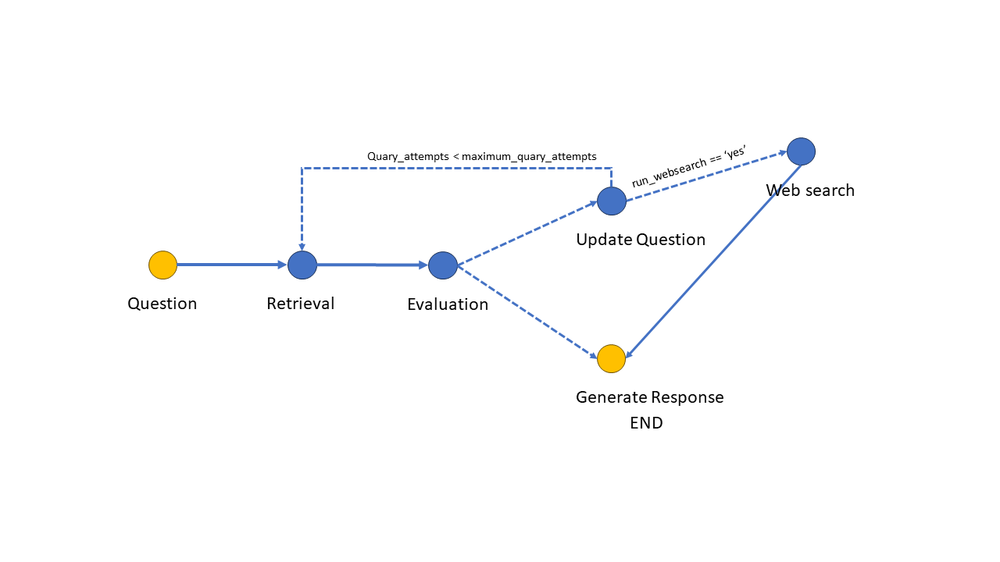
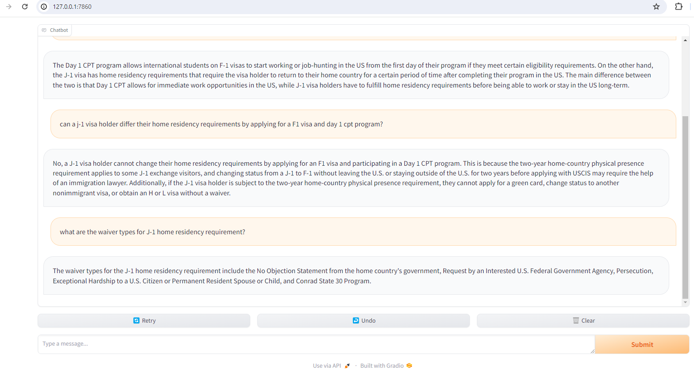

# Windows based C-RAG Augmented with websearch

My project for NVIDIA challenge 2024 and runs on windows using NVIDIA tensorRT-LLM as well as NVIDIA and TensorRT-LLM as OpenAI API on Windows. 

## Description

This repository is insprired by `langchains C-RAG` example and is specifically tested on US immigration laws, policies, and procedures. It aims to provide insights, answers, and guidance by leveraging advanced natural language processing techniques.
The state machine for the C/self-RAG is depicted in the following figure.



## Prerequisites

Before you begin, ensure you have met the following requirements:

- NVIDIA GPU with CUDA support to leverage the full potential of the models (RTX 4090 was used for this project).
- Python 3.10.9 (used in this project).

## Installation

To set up your environment to run this code, follow these steps:

1. **Install NVIDIA trt-llm for windows:**
   - NVIDIA trt-llm is required for optimizing inference on NVIDIA GPUs. Please install it by following the instructions available at [NVIDIA trt-llm Repository](https://github.com/NVIDIA/TensorRT-LLM/tree/main/windows)
   - For the underlying model I am using Llama-2-13b-chat-hf

2. **Clone NVIDIA OpenAI-like API:**
   - This project requires functionalities from the NVIDIA OpenAI-like API. Clone the repository from [trt-llm-as-openai-windows](https://github.com/NVIDIA/trt-llm-as-openai-windows)

3. **Install Python Dependencies:**
   - Install the required Python dependencies by running:
     ```bash
     pip install -r requirements.txt
     ```

## Usage

To use this project, run the following command in your terminal:

```bash
python python app.py --run_local yes --local_url "local URL from OpenAI-like API" --run_websearch no --maximum_query_attempt 3
```
- After running the above, a Gradio web app url should pop up and you can ask your immigration related questions (assuming that you are using the repository as is with the legal documents in the paper directory)



- Note that the bot doesn't have a history as it might confuse the model (due to the limited quality of the llama2 model used)

## License
Distributed under the unlicense License. See LICENSE for more information.

## Acknowledgments
This project makes use of the following open-source components:

NVIDIA TensorRT-LLM
NVIDIA trt-llm-as-openai-windows
Inspiration from langchains C-RAG example.
